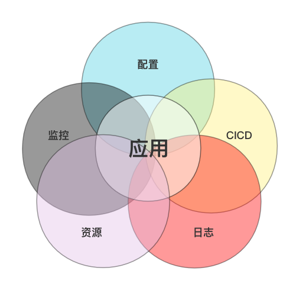

## 平台介绍

`zeus运维平台` 的定位是中小企业开箱即用运维平台, 以应用为核心, 围绕应用全生命周期进行设计, 方便二次开发.

   

## 特性

* 以应用为中心, 围绕应用的全生命周期来建设, 应用作为平台的一等公民
* 以企业落地为目的, 融合优秀开源组件, 尽量不重复造轮子, 解决中小企业通用问题
* 开发者友好, 面向开发者, 屏蔽底层技术细节, 提供开发者友好,无缝的使用体验
* 使用主流技术栈, 方便二次开发

  

## 功能预览

> TODO

